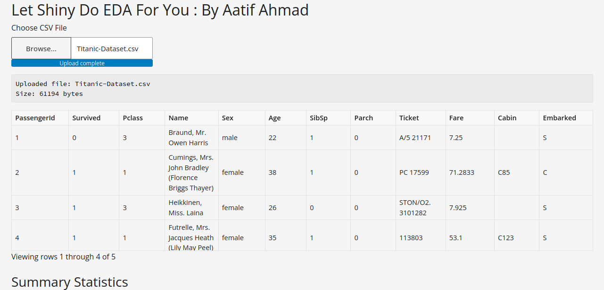
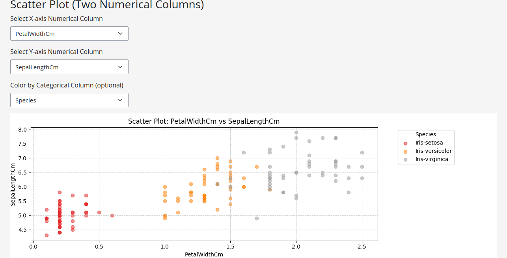

# Let Shiny Do EDA For You

## By Aatif Ahmad

Below are some visuals generated by the application for Exploratory Data Analysis (EDA):

#### Dataset Overview

#### Scatterplot by Categories

### The application is live at: [https://aatif-ahmad-data-viz.shinyapps.io/shiny_for_eda_by_aatif/](https://aatif-ahmad-data-viz.shinyapps.io/shiny_for_eda_by_aatif/)