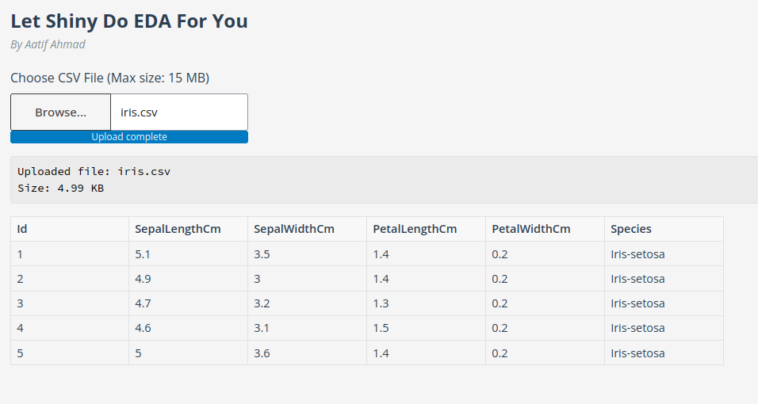
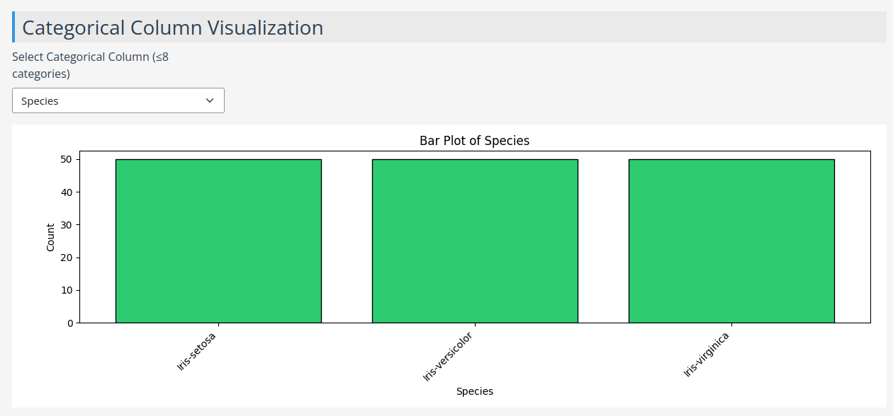
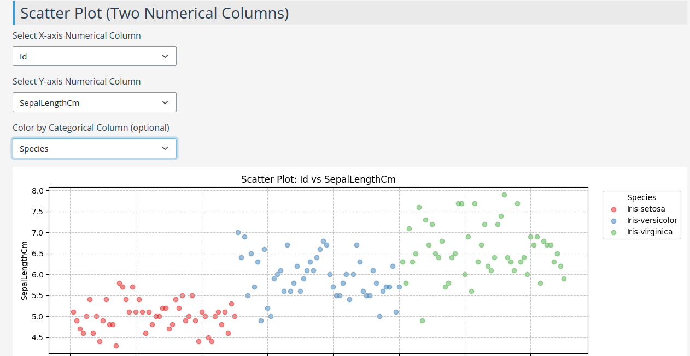

# Let Shiny Do EDA For You

## By Aatif Ahmad

Welcome to **Let Shiny Do EDA For You** — a web application built with **Python Shiny** that automates **Exploratory Data Analysis (EDA)** on your datasets with beautiful visualizations and detailed summaries.

The application helps you quickly explore your CSV files, view important statistics, handle missing values, and generate useful visualizations — without writing any code!

👉 **Live Application**: [https://aatif-ahmad-data-viz.shinyapps.io/shiny_eda/](https://aatif-ahmad-data-viz.shinyapps.io/shiny_eda/)

---

## 📂 Features

- **CSV Upload** (up to 15 MB)
- **Dataset Preview**: See the first few rows of your data.
- **Summary Statistics**: Mean, median, standard deviation, quartiles, etc. for numerical columns.
- **Missing Value Analysis**: View missing and complete value percentages.
- **Numerical Column Visualizations**:
  - **Histogram** (distribution)
  - **Boxplot** (outliers and spread)
- **Categorical Column Visualizations**:
  - **Bar Plot** for columns with up to 8 unique categories.
- **Scatter Plot**:
  - Choose two numerical features for X and Y axes.
  - Optionally color points by a categorical feature.
- **Interactive Filtering**:
  - Filter numerical columns by selecting a value range dynamically.
- **Color-coded and Responsive UI** for better readability.

---

## 🖼️ Example Outputs

Here are some examples of the visualizations generated by the app:

### 📄 1. File Upload and Dataset Overview
Displays basic info about the uploaded CSV (filename, size) and a preview of the dataset.
  

---

### 📊 2. Categorical Column Visualization
Visualizes the distribution of a selected categorical feature with a bar plot.
  

---

### 🔵 3. Scatter Plot (Colored by Classes)
Scatter plot of two selected numerical features, optionally colored by a categorical column (useful for observing patterns or clustering).
  

---

## ⚙️ How to Use

1. Upload a `.csv` file (max 15 MB).
2. Preview the dataset immediately after upload.
3. Explore:
   - Summary stats
   - Missing data analysis
   - Histograms and boxplots for numerical columns
   - Barplots for categorical columns
   - Scatterplots between two numerical columns
4. Adjust filters (range sliders) to subset the data dynamically.
5. Download insights or screenshots as needed!

---

## 🛠️ Tech Stack

- **Python** (Backend)
- **Shiny for Python** (UI and Reactive Components)
- **Matplotlib** (Plots)
- **Pandas** (Data Handling)
- **Hosted on ShinyApps.io**

---

## ✉️ Contact

Created with ❤️ by **Aatif Ahmad**  
Feel free to connect for feedback, improvements, or collaborations!